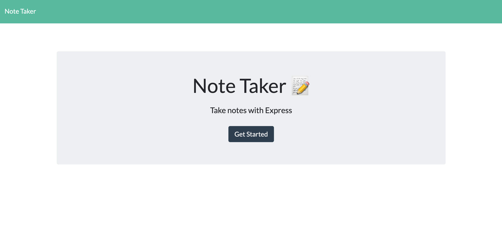
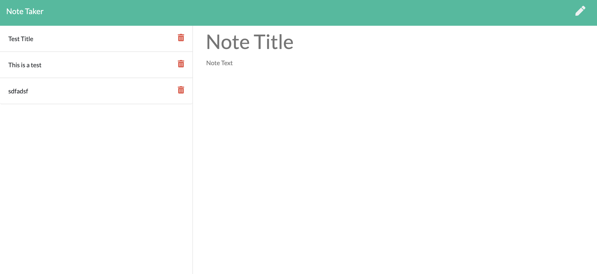

# Note Taker
A simple app meant to allow a user to add and delete notes that will be saved to the server via localhost and/or heroku/deployment.

## Examples

## How to use it
* run npm install before launching the application
* open the directory in your command line terminal
* launch with "node server.js" or "npm start" via the command line
* utilize the icons in th etop right as well as the trash can icon next to saved notes to create/delete notes

### User Story
* As a busy person
* I want to take notes and save them to a list
* So that I can keep track of them over time